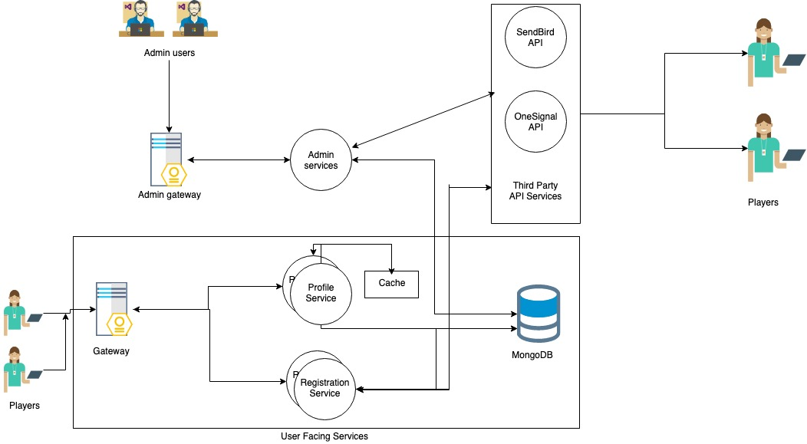

# Player-Service

This is a top level architecture for a player notification service. Below sections describe the given architecture diagram in detail.

# Architecture Diagram



[Architecture-Diagram](./diagrams/Player-Notification-Architecture.jpg)

## User Facing components

This section lists the user facing core components.

### User Gateway

This is the main entry point in our application. All the user to our internal service communication will be handled via the main gateway. This service can load balance as well as perform authentication for api requests. We can have a dedicated `Auth service` for this, but for brevity reasons, let the gateway handle all the incoming traffic routing and authentication mechanism for us.

### Profile Service

This service will help in player profile management. We can create and update player profile by exposing respective endpoints. In our case we will use this service to update the player stats like `purchases`, `level` and `device` used by the user/player.

There is one more component for caching player profile data. Whenever we request a player's profile, for the `first db call`, it will fetch it via our primary database. We will then cache this profile data into our caching layer. Thus, for subsequent requests, we will fetch data from our cache instead of fetching data via primary db. Using `LRU` cache policy will work fine for us as the most active users will be cached, thus saving precious db calls.

### Registration Service

This service will help us register new users. Once we register a new user, we also need to register this user with our third party apis like `SendBird` and `OneSignal` for chat and notification services.

## Admin facing components

### Admin gateway

This will be a special gateway for admins only. Admins can access admin services via this gateway.  

### Admin service

This is admin specific service. In our case it will be used to configure realtime notification messages.

Admin services will talk with our `primary db` and other `third party services`. In our case, it will fetch the target users to be notified and notify the respective players via third party services.

## Third party services

### SendBird

This service is used for realtime chat with other players. In our case this will be used to communicate our message to respective userswho fit the required criteria.

### OneSignal

This service will help in sending notifications via best effort mechanism.

## Steps to run

1. `cd $PROJECT_ROOT`
1. Create `.env` file based on env.example file
1. `docker-compose up -d`
1. `docker-compose logs -f web` to follow logs for web service (its a monolith for now, will transition it into microservices as per the diagram).
1. UI can be accessed via `http://localhost`. Make sure web service is up and listening on port `5001` before making any api requests.
1. `docker-compose down` to stop the service.

> Note: You might need to run `sudo docker-compose up -d` or run using account having appropriate permissions if you encounter operation not permitted/allowed error from mongodb driver

## Dynamic query builder

We want a `liveops` person to be able to dynamically query data. Thus, we have a dynamic query builder using expression tree in `C#`.
The format for the end user to submit dynamic query is as follows:

```
Device = android and Purchases > 5 and Level >= 10
```
> Notice that here the rule is every word (token) must be space separated. Only single line queries are supported.